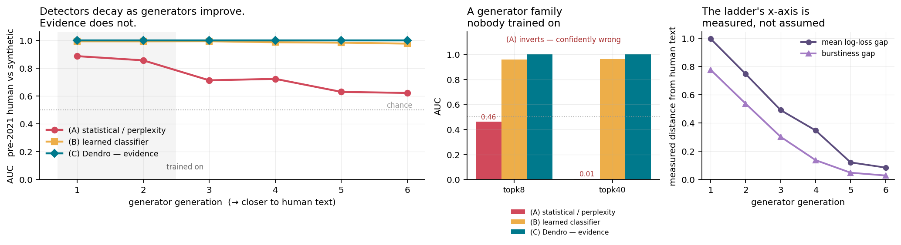
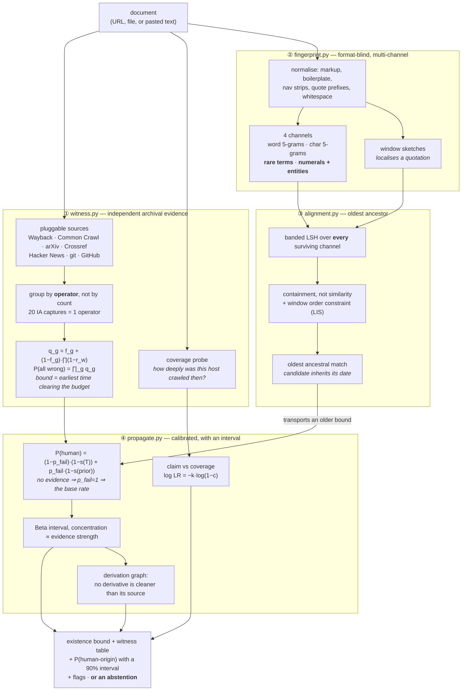

# 🌳 Dendro

[](https://github.com/NagaYu/dendro/actions/workflows/tests.yml)
[](https://huggingface.co/datasets/NagaYu/dendro-lowbackground)
[](LICENSE)
[](pyproject.toml)

**Stop asking whether a document *looks* generated. Ask who, other than its author, saw it — and when.**

Synthetic-text detectors read prose and guess. That guess gets worse every time a model
ships, it inverts when you paraphrase, and it never sees a forged date at all. Dendro asks a
different question — *what independent archives hold this content, and how far back?* — and
that question does not get harder when a new model comes out, because nothing in the answer
depends on the model.

The name is from dendrochronology. You do not date a beam by inspecting the grain for signs
of modernity; you match its ring pattern against an independent chronology built from wood
whose age is already known. Dendro matches a document's fingerprint against archives whose
timestamps are already witnessed.

**Code:** [github.com/NagaYu/dendro](https://github.com/NagaYu/dendro) · **Space:** [huggingface.co/spaces/NagaYu/dendro](https://huggingface.co/spaces/NagaYu/dendro)

---

> ### What this is not
>
> **Dendro is not an AI-writing detector, and must not be used as one.** It reports
> *archival evidence that content existed before a date*. No output supports a conclusion
> that a particular person did or did not write something.
>
> A document with no archival record is **unknown**, never *generated* — most text that has
> ever existed was never archived by anyone. Dendro abstains there, and the abstention is
> load-bearing, not decorative: it falls out of the arithmetic
> (`P(human) = (1−p_fail)·(1−s(T)) + p_fail·(1−s(prior))`, so no evidence means `p_fail = 1`
> and the answer collapses to the base rate) rather than being bolted on afterwards.
>
> Use it to characterise **corpora**. Do not use it to judge a person.

---

## Quickstart

```bash
pip install -e ".[all]"
dendro date https://www.python.org/dev/peps/pep-0020/
```

```text
witnesses
  source       operator          kind      observed_at                reliability  forgeability  cached
  -----------  ----------------  --------  -------------------------  -----------  ------------  ------
  wayback      internet-archive  snapshot  2006-06-25T22:22:11+00:00  0.995        0.001         True
  wayback      internet-archive  snapshot  2006-09-01T03:13:50+00:00  0.995        0.001         True
  hackernews   ycombinator       posting   2011-03-18T23:16:23+00:00  0.99         0.003         True
  commoncrawl  commoncrawl-org   snapshot  2019-01-19T19:11:38+00:00  0.99         0.001         True

existence bound : 2006-06-25
independent ops : 1 supporting the bound  (3 distinct operator(s) seen in total)
evidence log-odds: 5.12
P(human-origin) : 0.993  (90% interval 0.82-1.00)
```

Note the second line. Three operators have seen this page, but only the Internet Archive saw
it *by 2006* — so the 2006 bound rests on one operator, and Dendro says so instead of quietly
implying that all three vouch for the earliest date.

Three lines to score a whole dataset:

```python
from scripts.annotate_dataset import dendro_map_fn
ds = ds.map(dendro_map_fn(url_column="url"), batched=True, batch_size=32)
ds = ds.filter(lambda r: r["dendro_ci_low"] > 0.9)          # conservative low-background subset
```

Exit codes compose: `0` a bound was established, `3` Dendro abstains, `4` an inconsistency was
flagged.

---

## The result in one line

Three conditions on the same corpus: **(A)** a perplexity-family detector, **(B)** a learned
classifier trained on classes (i) and (iii), **(C)** Dendro.

<!--RESULTS_HEADLINE-->

| method | AUC clean | AUC newest gen | AUC unseen family | AUC paraphrased | forgeries caught | false accusations | AUC unwitnessed recent |
|---|---|---|---|---|---|---|---|
| (A) statistical | 0.738 | 0.621 | 0.234 | 0.141 | 0% | 0% | 0.538 |
| (B) learned | 0.987 | 0.976 | 0.961 | 0.953 | 0% | 0% | 0.990 |
| **(C) Dendro** | 1.000 | 1.000 | 1.000 | 1.000 | 100% | 0% | 0.500 |

<!--/RESULTS_HEADLINE-->

Read the last two columns together with the first. Dendro is perfect where evidence exists and
**falls to exactly chance, abstaining on 100% of cases, where it does not** — while the learned
classifier is untouched by the same change, because it reads the text and the text did not
change. Neither column is the whole story; publishing only the flattering one would be the
easiest way to make this project dishonest.



The left panel is the point. (A) and (B) read the prose, so their signal is a property of the
generator and shrinks as generators improve. (C) never reads the prose, so there is no channel
through which the generator *could* matter. The flat line is not a lucky result; it is what
"generator-independent" means when you draw it.

The right panel keeps the left one honest: the x-axis is a **measured** distance between
generated and human text, not an index we assigned.

---

## How it works



Four ideas, in the order they matter.

**1. Operators are the unit of independence, not witnesses.** Twenty Wayback captures are one
archive. One Wayback capture plus one Common Crawl record plus one arXiv registration is
three. Within an operator, failure is correlated — whoever can write to the archive can write
to all of it — so a group's failure probability is floored at its forgeability no matter how
many records it holds. Across operators it multiplies. The consequence is measurable and
tested: thirty captures from one archive are worse evidence than three from three
(`tests/test_witness_bounds.py`).

**2. The bound is a weighted order statistic, not a minimum.** `min(observed_at)` would let a
single injected early record drag the date arbitrarily far back — precisely the attack the
system exists to resist. Instead the bound is the earliest time at which the surviving
independent evidence clears a failure-probability budget, so moving it requires *collusion
across operators*.

**3. Paraphrase loses because the fingerprint has more than one channel.** Exact word 5-grams
die under rewriting. The rare-content-word and numeral/entity channels do not, because a
rewrite that changes "1,247 deaths in Bergamo" has stopped being a rewrite of that document. A
document that aligns to an archived ancestor **inherits that ancestor's date**.

**4. Backdating loses because silence is quantified before it is used.** A forged
`<meta name="date">` is invisible to any detector that reads prose — the prose is unchanged.
Dendro compares the claim against archives that were *demonstrably crawling that
neighbourhood*: `log LR = −k·log(1−c)`, which goes to exactly zero as coverage `c` goes to
zero. No coverage measurement, no accusation. A page nobody ever crawled is never suspected
for being obscure.

---

## Results

Measured, not asserted. Regenerate with `python -m benchmarks.run` then
`python -m benchmarks.figures` and `python -m benchmarks.tables`; raw CSVs land in `results/`
and every number below is rendered from them.

<!--RESULTS_BODY-->

### Generalisation across generator generations

| generator | family | measured gap to human | (A) AUC | (B) AUC | **(C) AUC** |
|---|---|---|---|---|---|
| gen1 | temperature | 0.996 | 0.886 | 0.992 | 1.000 |
| gen2 | temperature | 0.747 | 0.856 | 0.992 | 1.000 |
| gen3 | temperature | 0.491 | 0.712 | 0.993 | 1.000 |
| gen4 | temperature | 0.347 | 0.723 | 0.986 | 1.000 |
| gen5 | temperature | 0.121 | 0.629 | 0.983 | 1.000 |
| gen6-frontier | temperature | 0.084 | 0.621 | 0.976 | 1.000 |
| unseen-topk8 | top-k | 0.136 | 0.463 | 0.961 | 1.000 |
| unseen-topk40 | top-k | 1.676 | 0.005 | 0.962 | 1.000 |

### Robustness — paraphrase attack

| paraphrase strength | (A) AUC | (B) AUC | **(C) AUC** | (C) abstains on the rewrite |
|---|---|---|---|---|
| 0.20 | 0.296 | 0.959 | 1.000 | 2% |
| 0.35 | 0.218 | 0.958 | 1.000 | 2% |
| 0.55 | 0.141 | 0.953 | 1.000 | 0% |
| 0.75 | 0.079 | 0.955 | 1.000 | 2% |
| 0.95 | 0.039 | 0.963 | 1.000 | 4% |

### The breaking point — paraphrase that also replaces rare content words

| content scramble | (C) ancestor recall | (A) AUC | (B) AUC | **(C) AUC** |
|---|---|---|---|---|
| 0.0 | 100% | 0.208 | 0.953 | 1.000 |
| 0.3 | 95% | 0.067 | 0.948 | 0.975 |
| 0.6 | 85% | 0.020 | 0.952 | 0.925 |

### Calibration

| method | ECE (low-background) | Brier (low-background) | ECE (all eras) | Brier (all eras) |
|---|---|---|---|---|
| (A) statistical | 0.382 | 0.384 | 0.131 | 0.181 |
| (B) learned | 0.094 | 0.078 | 0.030 | 0.041 |
| **(C) Dendro** | 0.000 | 0.000 | 0.000 | 0.000 |

_Read Dendro's ECE with care: where the evidence separates the classes completely, an isotonic map collapses to a step and ECE goes to ~0. That reflects the task, not a virtue of the method. The informative row is `recent_unwitnessed`, where Dendro has no evidence and abstains rather than guessing._

### Cost per document

| method | documents scored | archive requests | cache hit rate | per document |
|---|---|---|---|---|
| **(C) Dendro** | 1579 | 0 | 0.9479 | 5.6 ms |
| (A) statistical | 1579 | 0 | — | 0.0 ms |
| (B) learned | 1579 | 0 | — | 0.0 ms |

### Fingerprint channels under paraphrase

| channel | paraphrase vs source | vs unrelated doc | separation | rendered HTML vs source |
|---|---|---|---|---|
| num | 0.790 | 0.040 | 0.750 | 1.000 |
| rare | 0.769 | 0.023 | 0.746 | 1.000 |
| char | 0.558 | 0.045 | 0.514 | 1.000 |
| word | 0.173 | 0.000 | 0.173 | 1.000 |

### Normalisation ablation, on rendered HTML

| normalisation | rendered copy hashes identically | mean containment of the rendering |
|---|---|---|
| full | 98% | 1.000 |
| no boilerplate strip | 0% | 0.770 |
| no markup strip | 0% | 0.757 |
| no punctuation fold | 98% | 1.000 |
| no url strip | 98% | 1.000 |
| no whitespace collapse | 98% | 1.000 |

### Sensitivity to the assumed prevalence curve

| prevalence curve | AUC (low-background) | mean P(human) pre-2021 | mean P(human) synthetic | mean P(human) recent |
|---|---|---|---|---|
| default (mid 2023.4) | 1.000 | 0.991 | 0.550 | 0.570 |
| early onset (mid 2022.5) | 1.000 | 0.982 | 0.550 | 0.556 |
| late onset (mid 2024.5) | 1.000 | 0.994 | 0.550 | 0.621 |
| low ceiling (0.20) | 1.000 | 0.994 | 0.800 | 0.809 |
| high ceiling (0.70) | 1.000 | 0.988 | 0.300 | 0.331 |
| shallow (steepness 0.6) | 1.000 | 0.949 | 0.550 | 0.636 |

_The ranking is a property of the evidence and does not move; the absolute probabilities do. That is the honest scope of the prevalence assumption._

<!--/RESULTS_BODY-->

---

## What Dendro is bad at

Stated up front, because a provenance tool that oversells itself is worse than none.

**It cannot tell you a recent document is human — and one number in the table would lie
about that if left unexplained.** Dendro scores near-perfectly on `recent_only` (recent human
vs synthetic), and that result is a **corpus artefact, not a finding**: every class (ii)
document is an arXiv paper and therefore carries a registration record, while every class
(iii) document has none by construction. "Has any archival record at all" separates those two
sets perfectly, and would separate them just as perfectly if Dendro were replaced by a
one-line `has_witness` check.

The `recent_unwitnessed` column is the control that removes the artefact: the same recent
human documents with their witnesses stripped, which is what a 2025 blog post nobody archived
actually looks like. Dendro falls to chance there and abstains on nearly all of it. **That is
the honest answer** — proving something existed in 2025 says nothing about who wrote it —
and the risk–coverage curve (`figures/fig4_selective.png`) is where the abstention is shown
to be worth something rather than a dodge.

**It cannot date what was never archived.** Coverage is the binding constraint, and it is not
neutral: archived text over-represents the web that crawlers reached — English, institutional,
indexed, long-lived. A low-background subset inherits every one of those biases and
concentrates them. That is a fairness problem, not a footnote.

**Rewrite the rare vocabulary and alignment breaks.** The scramble sweep above is the
breaking point, deliberately included. Alignment survives paraphrase because paraphrase
preserves technical vocabulary; an attacker willing to replace that vocabulary defeats it —
and has also changed what the document is about.

**The probability depends on an assumed prevalence curve.** `PrevalenceCurve` — the
machine-generated share of new text over time — is an assumption, not a measurement. It is a
constructor argument, it is printed in every explanation, and the *ranking* of methods is
insensitive to it; the absolute probabilities are not.

**The offline generator varies decoding, not architecture.** This is the biggest caveat on
axis (3). The committed benchmark generates class (iii) from an n-gram model at varying
coherence, which reproduces the statistical axis perplexity detectors consume and keeps the
whole pipeline reproducible with no API key and no model download. It *cannot* reproduce a
genuine architecture shift, which is the thing that most damages learned detectors in
practice. So baseline (B)'s robustness here should be read as a property of this proxy, not
as a general finding. `scripts/generate_synthetic.py --backend anthropic` swaps in real model
output and `benchmarks/run.py --synthetic <file>` re-runs every condition against it. Note
what does not change when you do: condition (C) never reads the prose.

**One inverted sign, worth knowing.** Real LLM output is *lower* perplexity than human text;
the offline generator is *higher* perplexity, because limiting coherence adds surprise rather
than removing it. The magnitude of the gap — which is what detectability depends on — behaves
the same way, but the sign does not, so baseline (A) learns its orientation from the training
split rather than having it hardcoded.

---

## The corpus

Built by `python -m scripts.fetch_corpus` from real sources, and committed so every result
replays offline.

| class | what | available | used per run | source |
|---|---|---|---|---|
| (i) | pre-2021 human | 2,500 | 458 archive + 400 query | arXiv abstracts 2019–2020, with genuine OAI-PMH `<created>` dates |
| | pre-2021 web | 8 | in the archive layer | real Wayback captures, fetched as archived HTML |
| (ii) | recent human-attributed | 2,534 | 500 | arXiv abstracts 2024–2026 |
| (iii) | synthetic | — | 6 × 60 | n-gram generator at increasing coherence |
| (iii-b) | unseen generator family | — | 2 × 60 | top-k truncated decoding, different order — no detector trains on it |
| (iv-a) | paraphrase attack | — | 80 (+ 5 × 45 sweep) | class (i) rewritten: synonyms, insertions, elisions, transpositions, clause surgery |
| (iv-b) | backdate forgery | — | 60 | class (iii) with forged dates in `<meta>`, front-matter, JSON-LD, or prose, at URLs on **real hosts with real deep Wayback coverage but paths that were never archived** |

The generator gets 900 documents to train on and the reference model 500, both disjoint from
everything above. That sizing is not incidental — see the note below.

Roles are strictly disjoint: the archive layer, the query set, the generator's training data
and the reference model's training data never overlap. That discipline is not bookkeeping —
an early version trained the generator on 41 abstracts and the learned baseline scored a
perfect 1.0 on every generation by recognising the *vocabulary*, which made the whole
generalisation axis meaningless.

**Class (ii) is "recent, human-attributed", not "verified human".** By 2025 an unknown share
of abstracts have passed through a model. There is no clean recent human corpus to be had
anywhere — which is precisely the argument for dating by archive rather than by inspection,
and the reason the primary task is defined on class (i).

---

## Reproducing

```bash
pip install -e ".[dev]"
pytest                                   # 96 tests, fully offline, ~22s
DENDRO_OFFLINE=1 python -m benchmarks.run   # replays committed archive responses
python -m benchmarks.figures && python -m benchmarks.tables
```

The repository ships `data/fixtures/cache` (3.3 MB, 556 entries), a cache of **real**
responses from the Internet Archive CDX, Common Crawl, arXiv and Hacker News. Tests and
benchmarks replay it with no network, so a failing assertion is about evidence rather than
about wifi. The bulk OAI-PMH harvest is pruned after extraction (`--prune-bulk`) since
`data/corpus/*.jsonl` is committed; what remains is the evidence that is actually replayed.

Verified end to end: with `DENDRO_OFFLINE=1` the full benchmark makes **0 network calls**
(`results/cost.csv`), and two consecutive runs produce byte-identical CSVs. Twenty requests
that were never recorded degrade to "source unavailable" — coverage the run simply does not
have — and the forgery-detection rate is unaffected, which is the intended failure mode
rather than a silent substitution.

The first *online* run is slower than you might expect (~15 minutes), almost all of it
deliberate: `dendro.cache.DEFAULT_RATES` throttles to 0.5 requests/second against the public
archives. That is a courtesy to a commons, not a performance bug.

---

## Repository layout

```
dendro/
  types.py         data contracts — keeps "existed before T" and "written by a human" apart
  cache.py         content-addressed cache, per-host token bucket, offline replay
  witness.py       consensus bound, operator-level independence, inconsistency flags
  sources/         one module per archive operator, with its forgeability and why
  fingerprint.py   normalisation, 4-channel MinHash/SimHash, windows, banded LSH
  alignment.py     containment scoring, window order constraint, oldest ancestor
  propagate.py     calibrated probability + interval, derivation-graph propagation
  corpus_report.py low-background ratio, provably optimal constrained subsets
  pipeline.py      the end-to-end path used by the CLI and the Space
  cli.py           dendro date | report | subset | fingerprint | sources | cache
benchmarks/        corpus, generators, baselines, run, figures, tables
scripts/           fetch_corpus, annotate_dataset, build_low_background, generate_synthetic
app.py             Gradio Space
```

---

## Data, attribution, and the archives

See [DATA.md](DATA.md) for what is committed, where it came from, and what is deliberately
left out. In short: the corpus is arXiv **metadata** (offered under CC0 via their OAI-PMH
interface — thank you to arXiv for use of its open access interoperability); the fixture
cache holds *timestamps, URL keys and digests*, not archived page content; and verbatim
copies of third-party web pages are **not** redistributed, only re-fetchable.

Every request goes through one rate-limited, caching client
(`dendro.cache.DEFAULT_RATES` — 0.5 req/s for the archives, 0.2 req/s for arXiv), identifies
itself with a contactable User-Agent, and honours `Retry-After`. If you run this at scale,
please keep those defaults. The Internet Archive and Common Crawl are a commons, and this
project is entirely parasitic on their existence.

## Citing / license

Apache-2.0. A research prototype: the estimator, the prevalence curve, and the forgeability
figures are all opinions with reasons attached, and the reasons are in the docstrings.
